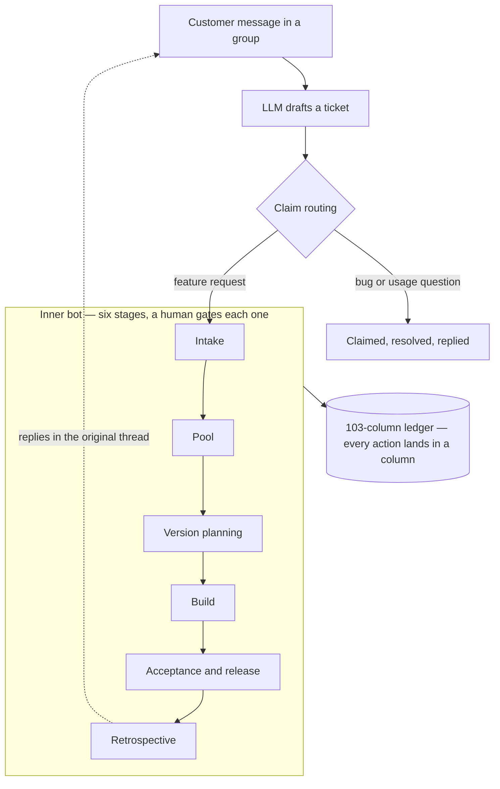

# Relay — a dual-bot requirements lifecycle system on Lark

Solo build. 5.5 weeks, 196 commits, 18.8k lines of Python, 272 tests.
Internal pilot at an AI robotics company in Beijing, 2026.

---

## The problem

At this company, a feature request from a customer began its life as a sentence
in a group chat. Someone in sales read it, relayed it verbally, and engineering
either never saw it or saw it stripped of context. Nobody could answer three
basic questions about any given request: who asked for it, who owns it now, and
what happened to it.

When I audited the backlog, I found **800+ untracked items**. About 95% of them
mapped cleanly onto four existing product lines — which meant the work wasn't
unknown, it was just unrecorded.

## What I built

Two bots and one ledger.

**The outer bot** watches customer group chats. It turns a single message into a
draft ticket, classifies it (bug / usage question / feature request), and posts a
claim card to the right internal group. Whoever claims it owns it. When the issue
is resolved, the bot replies in the customer's original thread — not a new one.

**The inner bot** runs a six-stage lifecycle for anything that becomes real work:
intake → requirement pool → version planning → build → acceptance & release →
feedback & retrospective. Every judgment call is a human pressing a button on an
interactive card. The bot moves state; it doesn't decide.

**The ledger** is a single 103-column table. Every action either lands in a column
or didn't happen.

## Architecture

Hexagonal. The domain core — a 15-state machine, the routing rules, the stage
transitions — imports no vendor SDK at all. Adapters sit behind ABC interfaces.

The practical payoff: **all 272 tests run offline against mock adapters**, with no
Lark credentials and no network. The same entrypoint swaps in the real adapters
for deployment. `demo_happy_path.py` walks the full lifecycle end to end on your
laptop in a few seconds.

## Three decisions I'd defend

**Ownership by claim, not by AI matching.** The obvious design is to have the model
route each ticket to whoever looks most relevant. I route to a group and let a
human claim it. Responsibility isn't about relevance — it's about who is willing
to own the thing. A claim is also an auditable record of a decision, which a
similarity score never is.

**Every fallback emits a signal.** When routing can't find an owner, it falls back
to the engineering lead *and* flags the mapping gap. A silent fallback is how a
system looks healthy for months while quietly degrading — the failure mode where
nothing breaks, no alert fires, and you find out by accident.

**Abstract on the third occurrence.** Bug routing, feature routing, and usage-question
routing each got their own implementation first. Only when all three had visibly
converged on the same shape did they collapse into one claim-card function. Two
similar things are a coincidence.

## Where it got to

- Full dual-track loop running on live Lark infrastructure (July 2026)
- Legacy audit: 800+ items normalized, ~95% mapped to four product lines; the
  findings drove a redesign of how versions get planned
- Demo package delivered to its first internal stakeholder

## Honest status

This is an **internal pilot**, demo-ready. It is not deployed to customers and I'm
not claiming production. Some rough edges are known and tracked.

The source is private — it was built inside an employer's context. I'm happy to
walk through the code live.

---

## What I'd bring to your project

Most of what made this work wasn't the model. It was deciding where a human has to
stay in the loop, making the system say so when it doesn't know, and keeping the
domain logic clean enough that you can test the whole thing without touching a
vendor API.

Also on the shelf: a product-catalog extraction pipeline (6,194 products at 99.8%
field completeness, four-layer fallback strategy), and a CLI that turned an
"untestable" cross-language QA task into something a non-native-speaker team could
actually run.

Before engineering I taught math for seven years. I write documentation people
read, and I run discovery conversations that surface what you actually need built.

📫 More at **[jacky-mypage.pages.dev](https://jacky-mypage.pages.dev)**
